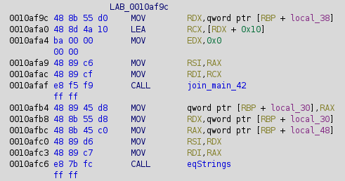
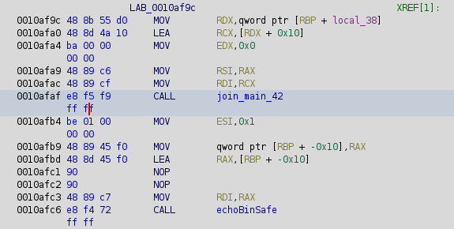

### What I did to solve this

I loaded up the chall elf/binary into Ghidra
This is a nim program which I have never seen before
ghidra is analyzing it as a C program
Followed the main program as to a NimMainModule

This takes input and compares with some string loaded from somewhere
I can up with a few ideas on what I could find out what this memory was:
    - Back track through this code and see the memory/code that loads this 
        - This gets generated through many calls and would use too much of my brain power
    - Get the source code from ghidra and try running it in an editor. 
        - This would require an editor in my VM and using a lot of power/memory that I don't know if it could handle
        - As well, there is no guarentee that the source code comes back as compilable
    - Modify the binary to print out the loaded memory
        - I chose this option as it was easy to do in Ghidra already 
        - As well, the assembly already gives an easy bit of code that I could copy to print out a string

#### Original Code 


#### New Code:


From this, there is the join_main_42 call. This is the code that returns the unknown memory that I want to see.
I end up copying code later in the assembly and adding a few nops to pad out the space that went unused. 

This is what gets printed out:

```
CakeCTF{s0m3t1m3s_n0t_C}
Wrong...
```

And what do you know its the flag. I suspected this as what the program prints out is whether you are right or wrong.


